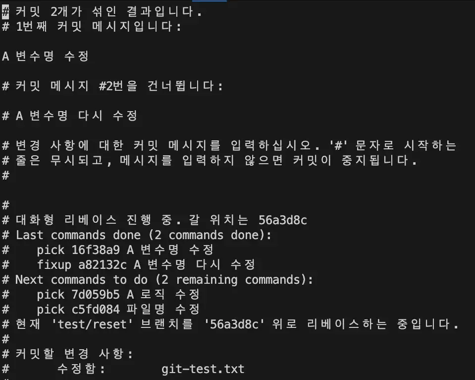

# Git 활용 잘해보기

[](https://hits.seeyoufarm.com)

**Q: 이 문서는 왜 작성되었나요?**

**A:** 프로젝트를 할 때 항상 변수는 존재하기에 작업 도중 History를 수정해야 하는 상황은 자주 발생합니다. 이런 상황에서 사용할 수 있는 전략을 설명합니다. 궁극적으로는 실무에서 유용한 Git의 다양한 기능을 다뤄 보고 더 **효율적으로 작업**할 수 있도록 하기 위함입니다.

**Q: 왜 "Git History"를 관리해야 하나요?**

**A:** Git History는 프로젝트의 **성장과 진행 과정**을 나타냅니다. 그렇기에 협업하는 사람이 많아질수록 Git History를 관리하는 것은 중요해집니다.

> [!WARNING]
> 실무에서 자주 마주치는 상황에서 Git History를 관리하는 방법, Git을 통해 더 효율적으로 작업할 수 있도록 돕는 여러 기능을 다룹니다. 따라서 개념은 가볍게 다루고 넘어가므로 개념이나 원리에 대해 자세히 알고 싶다면 [Git 공식 문서](https://git-scm.com/doc)를 참고해 주세요.

## 목차

<!-- AUTO-GENERATED-CONTENT:START (TOC:collapse=true&collapseText=자세히 보려면 클릭하세요&excludeText=목차) -->
<details>
<summary>자세히 보려면 클릭하세요</summary>

- [요약](#%EC%9A%94%EC%95%BD)
  - [커밋을 수정하는 방법](#%EC%BB%A4%EB%B0%8B%EC%9D%84-%EC%88%98%EC%A0%95%ED%95%98%EB%8A%94-%EB%B0%A9%EB%B2%95)
  - [Git Stash](#git-stash)
  - [Git Reset](#git-reset)
  - [Git Bisect](#git-bisect)
  - [Git Merge](#git-merge)
  - [Git Rebase](#git-rebase)
  - [Git Reflog](#git-reflog)
- [Git Stash](#git-stash-1)
- [Git Reset](#git-reset-1)
  - [--soft 옵션](#--soft-%EC%98%B5%EC%85%98)
  - [--hard 옵션](#--hard-%EC%98%B5%EC%85%98)
  - [--mixed 옵션](#--mixed-%EC%98%B5%EC%85%98)
  - [실무에서의 사용 예시](#%EC%8B%A4%EB%AC%B4%EC%97%90%EC%84%9C%EC%9D%98-%EC%82%AC%EC%9A%A9-%EC%98%88%EC%8B%9C)
- [Git Bisect](#git-bisect-1)
- [Git Merge](#git-merge-1)
  - [기본 사용법](#%EA%B8%B0%EB%B3%B8-%EC%82%AC%EC%9A%A9%EB%B2%95)
  - [충돌 해결](#%EC%B6%A9%EB%8F%8C-%ED%95%B4%EA%B2%B0)
  - [Fast-Forward 병합](#fast-forward-%EB%B3%91%ED%95%A9)
  - [No-Fast-Forward 병합](#no-fast-forward-%EB%B3%91%ED%95%A9)
  - [Squash 병합](#squash-%EB%B3%91%ED%95%A9)
  - [실무에서의 사용 예시](#%EC%8B%A4%EB%AC%B4%EC%97%90%EC%84%9C%EC%9D%98-%EC%82%AC%EC%9A%A9-%EC%98%88%EC%8B%9C-1)
- [Git Rebase](#git-rebase-1)
- [Git Reflog](#git-reflog-1)
- [상황에 맞게 사용하는 Merge, Rebase, Squash](#%EC%83%81%ED%99%A9%EC%97%90-%EB%A7%9E%EA%B2%8C-%EC%82%AC%EC%9A%A9%ED%95%98%EB%8A%94-merge-rebase-squash)
- [마지막 커밋을 수정하는 방법](#%EB%A7%88%EC%A7%80%EB%A7%89-%EC%BB%A4%EB%B0%8B%EC%9D%84-%EC%88%98%EC%A0%95%ED%95%98%EB%8A%94-%EB%B0%A9%EB%B2%95)
- [여러 개의 커밋 메시지를 수정하고 싶은 경우](#%EC%97%AC%EB%9F%AC-%EA%B0%9C%EC%9D%98-%EC%BB%A4%EB%B0%8B-%EB%A9%94%EC%8B%9C%EC%A7%80%EB%A5%BC-%EC%88%98%EC%A0%95%ED%95%98%EA%B3%A0-%EC%8B%B6%EC%9D%80-%EA%B2%BD%EC%9A%B0)
- [마무리](#%EB%A7%88%EB%AC%B4%EB%A6%AC)
- [참고](#%EC%B0%B8%EA%B3%A0)

</details>
<!-- CUSTOM-AUTO-GENERATED-CONTENT:END -->

## 요약

<details>
<summary>자세히 보려면 클릭하세요</summary>

### 커밋을 수정하는 방법

- `git commit --amend`를 사용하여 최신 로그 메시지를 변경할 수 있습니다.
- `git commit --amend`를 사용하여 가장 최근 커밋을 수정할 수 있습니다.
- `git rebase`를 사용하여 커밋을 합치고 로그를 수정할 수 있습니다.
- `git rebase -i`를 사용하면 로그 수정 시 표준 `git rebase`보다 훨씬 정밀한 제어가 가능할 수 있습니다.

### Git Stash

- `git stash`를 사용하여 작업을 저장하고 나중에 불러올 수 있습니다.
- 주로 브랜치를 변경해야 하는데 아직 커밋하고 싶지 않은 경우에 유용합니다.
- `git stash apply`로 저장한 작업을 불러올 수 있으며, 여러 번 사용한 경우 최근 stash를 선택하여 적용할 수 있습니다.
- 저장된 작업을 새로운 브랜치에 적용하려면 `git stash branch <브랜치 이름>`을 사용합니다.
- 불필요한 stash는 `git drop`이나 `git stash clear`로 제거할 수 있습니다.

[Git Stash에 대해 자세히 알아보기](#git-stash-1)

### Git Reset

- `git reset`을 사용하여 커밋을 초기화할 수 있습니다.
- 주로 실수로 커밋한 지저분한 코드를 수정할 때 유용합니다.
- `git reset --soft HEAD~1`을 사용하여 최근 커밋을 초기화하면서 변경 사항을 유지할 수 있습니다.

[Git Reset에 대해 자세히 알아보기](#git-reset-1)

### Git Bisect

`git bisect`를 사용하면 복잡한 코드베이스에서 문제가 발생한 커밋을 효과적으로 찾아낼 수 있습니다.

1. 버그가 없었던 마지막 커밋을 찾습니다.
2. 버그가 있는 현재 상태의 커밋을 확인합니다.
3. `git bisect`를 시작하여 좋은 커밋과 나쁜 커밋을 지정합니다.
4. 자동으로 `checkout` 된 커밋에서 테스트 스크립트를 실행하거나 수동으로 버그를 확인합니다.
5. 테스트 결과에 따라 해당 커밋을 좋은 상태 또는 나쁜 상태로 표시합니다.
6. 버그를 도입한 커밋을 찾으면 `git bisect reset`을 실행하여 `bisect` 세션을 종료합니다.

[Git Reset에 대해 자세히 알아보기](#git-bisect-1)

### Git Merge

`git merge` 명령어는 두 개의 브랜치를 하나로 합치는 데 사용됩니다. 기본적인 사용법은 다음과 같습니다:

```bash
git checkout main
git merge feature
```

`git merge`는 fast-forward, no-fast-forward, squash 등 다양한 옵션을 제공하며, 실무에서는 주로 기능 개발의 완료나 배포 전략에 활용됩니다.

[Git Merge에 대해 자세히 알아보기](#git-merge-1)

### Git Rebase

`git rebase` 명령어는 주로 커밋 로그를 다루기 위해 사용되며, 기능 브랜치를 메인 코드 베이스에 병합하기 전 로그를 정리할 수 있습니다. 기본적인 사용법은 다음과 같습니다:

```bash
git checkout feature_branch
git rebase main_branch
```

충돌이 발생하면 충돌을 해결하고 계속 진행합니다. `rebase` 후에는 fast-forward 병합을 통해 선형 로그를 유지할 수 있습니다.

[Git Rebase에 대해 자세히 알아보기](#git-rebase-1)

### Git Reflog

`git reflog` 명령어는 Git의 내부 로그로 HEAD와 브랜치의 변경 이력을 확인할 수 있습니다. 주로 **실수로 삭제한 커밋을 복구**하거나, `rebase` 등으로 인한 문제를 해결하는 데 활용됩니다. 커밋을 복구하려면 `git reset --hard HEAD@{n}` 명령어를 사용하면 됩니다. 주의: `git reflog`는 로컬 저장소에만 존재하므로 복구 후에는 강제 푸시가 필요할 수 있습니다.

[Git Reflog에 대해 자세히 알아보기](#git-reflog-1)

</details>

## Git Stash

`git stash`를 실행하면 **커밋하지 않고도 작업을 저장**할 수 있습니다. 보통 아래와 같은 상황일 때 유용합니다.

`feat/1` 브랜치에서 1번 기능을 작업하고 있습니다. 그러다 급하게 수정해야 할 사항이 생겨 `hotfix/1` 브랜치로 전환해야 하는 경우가 종종 있습니다. 하지만 아직 `feat/1` 브랜치에 커밋되지 않은 코드가 꽤 지저분(디버깅 코드가 포함되어 있는 등)하다면 아직 커밋하고 싶지 않을 겁니다.

이때 `git stash`를 실행하면 됩니다. `stash`는 브랜치에 임시 로컬 커밋을 저장하는 것과 같다고 생각하면 됩니다. 또한 `stash`는 원격 레포로 푸시할 수 없으므로 개인적으로 용도로 실행하면 됩니다.

이제 기존 브랜치의 커밋 로그를 더럽히지 않고 안전하게 브랜치를 변경할 수 있게 되었습니다. 작업을 끝내고 다시 `feat/1` 브랜치로 돌아와서 **저장해 둔 코드를 불러오고 싶다면** `git stash apply`를 실행하면 저장된 코드를 쉽게 불러올 수 있습니다.

`stash`를 여러 번 실행했었고 그중 **가장 최근** stash를 적용하고 싶다면 아래처럼 하면 됩니다:

```bash
git stash list
> stash@{0}: WIP on test/stash: 1fe8781 test: ff-only2
> stash@{1}: WIP on test/stash: 1fe8781 test: ff-only2
> stash@{2}: WIP on test/stash: 1fe8781 test: ff-only2

git stash apply stash@{0}
```

stash로 저장된 커밋을 **새로운 브랜치에 적용**하고 싶다면 아래처럼 하면 됩니다:

```bash
git stash branch ${브랜치 이름}
> 새로 만든 ${브랜치 이름} 브랜치로 전환합니다
> 현재 브랜치 ${브랜치 이름}
```

만약 저장되어 있는 일부 stash를 **제거**하고 싶다면 `git drop`을 실행하여 stash를 개별적으로 제거하거나, `git stash clear`를 사용하여 모든 stash를 제거할 수 있습니다.

## Git Reset

`git reset`을 실행하면 **커밋을 초기화**하거나 변경 사항을 다시 스테이징할 수 있습니다. 보통 실수로 지저분한 코드를 커밋한 상황일 때 유용하게 사용할 수 있습니다.

> [!NOTE]
> 단순히 마지막 커밋 메시지를 수정하거나 다른 커밋 안에 밀어 넣는 작업을 하고 싶다면 [마지막 커밋을 수정하는 방법](#%EB%A7%88%EC%A7%80%EB%A7%89-%EC%BB%A4%EB%B0%8B%EC%9D%84-%EC%88%98%EC%A0%95%ED%95%98%EB%8A%94-%EB%B0%A9%EB%B2%95) 섹션을 참고해 주세요.
> 최근 커밋이 아니라 여러 개의 예전 커밋을 수정하려면 [여러 개의 커밋 메시지를 수정하고 싶은 경우](#%EC%97%AC%EB%9F%AC-%EA%B0%9C%EC%9D%98-%EC%BB%A4%EB%B0%8B-%EB%A9%94%EC%8B%9C%EC%A7%80%EB%A5%BC-%EC%88%98%EC%A0%95%ED%95%98%EA%B3%A0-%EC%8B%B6%EC%9D%80-%EA%B2%BD%EC%9A%B0) 섹션을 참고해 주세요.

실수로 지저분한 코드까지 포함되어 커밋된 상황이라고 예를 들어보겠습니다. 이때 `git reset` 명령어를 사용하면 코드가 아직 커밋되지 않은 것처럼 처리할 수 있습니다. 이렇게 하려면 `git reset --soft HEAD~1`을 실행합니다. 여기서 `HEAD~1`은 가장 최근 커밋을 나타냅니다. 커밋 해시를 기준으로 입력할 수도 있습니다.

```bash
# HEAD
git reset --soft HEAD~2
# 커밋 해시
git reset --soft 12a34b5
```

`git reset`은 `--soft`, `--hard`, `--mixed`라는 세 가지 주요 옵션과 함께 사용될 수 있으며, 각 옵션은 Git의 세 가지 주요 영역인 작업 디렉토리(Working Directory), 스테이징 영역(Staging Area), 그리고 저장소(Repository)에 다르게 영향을 미칩니다. `git reset`의 역할을 정확히 이해하기 위해 이 옵션 간의 차이를 알아보겠습니다.
<small> 그림으로 표현할 재주가 없어 글로 설명하겠습니다 </small>

### --soft 옵션

`git reset --soft` 옵션은 커밋 메시지를 수정하거나 추가 변경 사항을 커밋에 포함시키고 싶을 때 유용합니다.. 이 옵션을 사용하면 지정된 커밋으로 HEAD는 이동하지만, **작업 디렉토리는 영향을 받지 않고 스테이징 영역의 상태는 리셋 직전 상태로 유지**됩니다.

```bash
git reset --soft HEAD~1
```

위 명령은 가장 최근 커밋을 취소하고, 그 커밋의 변경 사항들을 스테이징 영역에 남겨둡니다.

### --hard 옵션

`git reset --hard` 옵션은 실수로 잘못된 파일을 커밋했거나, 작업을 처음부터 다시 시작하고 싶을 때 유용합니다. 이 옵션을 사용하면 HEAD는 지정된 커밋으로 이동하고, **스테이징 영역과 작업 디렉토리 모두 리셋 직전 상태로 되돌려**집니다.

```bash
git reset --hard HEAD~1
```

위 명령은 가장 최근 커밋을 취소하고, 그 커밋의 변경 사항들을 작업 디렉토리에서 완전히 제거합니다. 주의해야 할 점은, `--hard` 옵션은 변경 사항을 영구적으로 삭제하므로 사용에 주의가 필요합니다.

### --mixed 옵션

`git reset --mixed` 옵션은 커밋을 재구성하고 싶거나 스테이징된 변경 사항을 다시 검토하고 싶을 때 유용합니다. 이 옵션을 사용하면 HEAD는 지정된 커밋으로 이동하고, **스테이징 영역의 상태는 리셋되지만, 작업 디렉토리의 파일들은 그대로 유지**됩니다.

```bash
git reset --mixed HEAD~1
```

위 명령은 가장 최근 커밋을 취소하고, 그 커밋의 변경 사항들을 스테이징 영역에서 제거합니다. 그러나 작업 디렉토리의 파일들은 변경 사항이 그대로 남아 있어서 다시 스테이징하거나 수정할 수 있습니다.

<small> 옵션의 작동 원리 등 자세한 내용은 [Git 공식 문서](https://git-scm.com/book/ko/v2/Git-%EB%8F%84%EA%B5%AC-Reset-%EB%AA%85%ED%99%95%ED%9E%88-%EC%95%8C%EA%B3%A0-%EA%B0%80%EA%B8%B0)에서 확인해 주세요. </small>

### 실무에서의 사용 예시

**오타가 있어 커밋 메시지를 수정하고 싶을 때**는 `--soft` 옵션을 사용하면 됩니다.

```bash
# 실수로 오타를 낸 초기 커밋
git commit -m "오타 난 커밋 메시지"
# --soft 옵션을 사용하여 리셋 후 다시 커밋
git reset --soft HEAD~1
git commit -m "정확하게 작성한 커밋 메시지"
```

위는 마지막 커밋을 취소하고 **변경 사항을 스테이징 상태로 유지**하여 새로운 커밋 메시지로 다시 커밋한 방식입니다.
<br />

**잘못된 파일을 커밋해서 이 변경 사항을 완전히 제거하고 싶을 때**는 `--hard` 옵션을 사용하면 됩니다.

```bash
# 잘못된 파일을 커밋
git commit -m "잘못된 파일 추가"
# 이 변경 사항을 완전히 제거
git reset --hard HEAD~1
```

위는 마지막 커밋을 취소하고 **작업 디렉토리와 스테이징 영역에서 모든 변경 사항을 제거**합니다.
<br />

**여러 파일을 커밋했지만 일부 파일의 커밋을 취소하고 싶을 때**는 `--mixed` 옵션을 사용하면 됩니다.

```bash
# 실수로 모든 파일을 커밋
git add .
git commit -m "모든 파일 추가"
# 일부 파일의 커밋을 취소하고 싶을 때
git reset --mixed HEAD~1
# 이제 선택적으로 파일을 다시 스테이징할 수 있습니다.
git add file1.txt file2.txt
git commit -m "특정 파일 추가"
```

위는 마지막 커밋을 취소하고 **스테이징된 변경 사항을 해제하지만, 작업 디렉토리의 파일들은 그대로 유지**하여 선택적으로 다시 스테이징하고 커밋할 수 있게 합니다.
<br />

`git reset` 명령어와 각 옵션들은 상황에 따라 매우 유용하게 사용될 수 있습니다. 그러나 특히 `--hard` 옵션은 데이터를 영구적으로 삭제할 수 있으므로 신중히 사용해야 합니다.

## Git Bisect

협업을 하다보면 제품에 버그가 발견되었지만, 해당 **버그가 언제 코드에 도입되었는지 명확하지 않은 경우**가 있습니다. 이럴 때 `git bisect`를 사용하면 버그를 효율적으로 찾아낼 수 있습니다.

`git bisect` 명령어는 이진 검색 알고리즘을 사용하여 버그가 도입된 커밋을 찾아내는 데 사용합니다. 특히 대규모 프로젝트에서 버그가 언제 처음 발생했는지를 파악할 때 매우 유용합니다.

매우 간단한 예시 상황을 들어보겠습니다. `box`라는 클래스 명을 가진 요소의 배경색은 원래 파란색이어야 하지만 현재 빨간색입니다. 그러나 언제 어떻게 빨간색이 되었는지 알 수 없습니다. 이 의도치 않게 빨간색으로 변경한 커밋을 찾아보도록 하겠습니다.

`git bisect`를 시작하기 전에, 버그가 없는 '좋은' 상태의 커밋과 버그가 있는 '나쁜' 상태의 커밋을 알고 있어야 합니다.

이 상황에선 언제 이 '나쁜' 커밋이 추가되었는지 알 수 없으므로 발견한 현재 HEAD를 '나쁜' 커밋으로 지정하겠습니다. 좋은 커밋은 이 파일이 생성된 시점으로 해두겠습니다. 먼저 `git log`를 실행해 이 파일이 생성된 시점의 커밋 해시를 복사하겠습니다.

```bash
$ git log

* f9965b5 (HEAD -> main) 그냥 채워넣는 커밋2
* a26733d 그냥 채워넣는 커밋
* 6dc333a :memo: Update docs
* 667aa60 (origin/main, origin/HEAD) Increase width of box to 200px
* fefbd00 Remove animation from red box
* cb09d2a 의도치 않는 버그 코드 삽입
* 79381ec Add animation to the blue box
* e81d361 :sparkles: 테스트용 html 생성
...
```

이제 `bisect`를 시작하고 git에 나쁜 커밋과 좋은 커밋을 알리도록 하겠습니다.

```bash
$ git bisect start
$ git bisect bad          # 현재 HEAD가 버그가 있는 상태로 가정
$ git bisect good e81d361 # 버그가 없었던 마지막 알려진 커밋

이등분: (대략 2 단계) 뒤에 시험할 리비전이 3개 남았습니다
[667aa609bf57864efa1118c63cc6b9260f5e2adf] Increase width of box to 200px
```

이후 `git bisect`는 자동으로 중간 지점의 커밋으로 `checkout`하고, 해당 상태에서 버그를 테스트하도록 요청합니다. 버그가 재현되면 '나쁜' 상태로, 그렇지 않으면 '좋은' 상태로 표시합니다. `git bisect`는 이 정보를 바탕으로 다음 테스트할 커밋을 선택하고, 이 과정을 반복하여 버그를 도입한 커밋을 찾아냅니다.

```bash
git bisect bad  # 현재 커밋에서 버그가 발견되면
git bisect good # 현재 커밋에서 버그가 없으면
```

이 상황에선 `box` 요소의 배경 색상을 웹 페이지에서 확인하며 커밋 상태를 깃에게 알리면 되겠죠.

웹 페이지를 새로고침하고 문제가 사라졌는지 확인합니다.

<p align="center">
  
</p>

문제가 여전히 존재하므로 `git bisect bad`를 실행하여 git에 여전히 문제가 있는 커밋임을 알립니다. 배경색이 빨간색이 아니었던 커밋을 찾을 때까지 이 과정을 반복합니다.

```bash
$ git bisect bad

# git이 올바른 커밋을 찾기 전에 검색해야 하는 커밋 수를 알려줍니다.
이등분: (대략 1 단계) 뒤에 시험할 리비전이 1개 남았습니다
[cb09d2a1b41c4e74f7a8f717eb4439e205f85fa4] 의도치 않는 버그 코드 삽입
...
$ git bisect bad

이등분: (대략 0 단계) 뒤에 시험할 리비전이 0개 남았습니다
[79381ec656cfc7b3b1fc60fa8c468c2f0eaa9299] Add animation to the blue box
```

... 그리고 웹 페이지 새로고침...

<p align="center">
  
</p>

박스 배경 색상이 더 이상 빨간색이 아니므로 좋은 커밋입니다. `git bisect good`을 실행합니다:

```bash
$ git bisect good

cb09d2a1b41c4e74f7a8f717eb4439e205f85fa4 is the first bad commit
commit cb09d2a1b41c4e74f7a8f717eb4439e205f85fa4
Author: jaem1n207 <roy.jm.lee@gmail.com>
Date:   Wed Jan 17 15:13:37 2024 +0900

    의도치 않는 버그 코드 삽입

 index.html | 2 +-
 1 file changed, 1 insertion(+), 1 deletion(-)
```

이제 `git show`를 사용하여 커밋을 확인하고 문제를 파악할 수 있습니다:

```bash
$ git show cb09d2a1b41c4e74f7a8f717eb4439e205f85fa4
```

<p align="center">
  
</p>

작업이 끝나면 `git bisect reset`을 실행해 브랜치를 원래 상태로 되돌립니다:

```bash
git bisect reset # bisect 섹션 종료
```

매우 간단한 예시라 두 커밋 사이의 간격이 크지 않습니다. 실제 상황에선 훨씬 간격이 큰 경우가 많을 겁니다. 간격이 큰 경우 번거롭긴 하겠지만, 대부분의 경우 문제를 발견할 수 있습니다.

이 과정을 통해 문제가 되는 커밋을 빠르게 찾아 문제를 해결하고, 해당 버그가 어떻게 코드에 포함되었는지 알 수 있습니다. 이는 팀 내에서 코드 리뷰를 진행하거나, 향후 비슷한 문제를 방지하기 위해 활용될 수 있습니다.
<small>물론 가장 좋은 것은 이 기능을 사용하는 일이 없는 것입니다.</small>

## Git Merge

`git merge` 명령어는 **두 개의 브랜치를 하나로 합치는 데 사용**됩니다. 이는 브랜치 간의 작업을 병합할 때 주로 사용되며, 기능 개발이 완료되어 메인 코드 베이스에 병합해야 할 때 유용합니다.
<small> 병합과 관련해서 처음 다루는 섹션이니 여기서만 다른 섹션에 비해 조금 더 자세히 분리해서 설명하도록 하겠습니다. </small>

### 기본 사용법

`main` 브랜치에 `feature` 브랜치를 병합하는 기본적인 과정은 다음과 같습니다:

```bash
git checkout main
git merge feature
```

이 명령은 `feature` 브랜치의 변경 사항을 `main` 브랜치에 병합합니다.

### 충돌 해결

병합 과정에서 두 브랜치에서 같은 파일의 같은 부분을 수정했다면 충돌이 발생할 수 있습니다. Git은 자동으로 이를 해결할 수 없을 때 사용자에게 충돌을 해결하도록 요청합니다.

```bash
# 충돌이 발생한 경우
git merge feature
# 충돌을 해결한 후
git add .
git commit -m ${커밋 메시지}
```

충돌을 해결하고 나면, 변경 사항을 스테이징하고 새로운 커밋을 만들어 충돌을 해결한 상태를 기록합니다.

### Fast-Forward 병합

`feature` 브랜치가 `main` 브랜치로부터 분기된 이후 `main` 브랜치에 새로운 커밋이 없다면, fast-forward 병합이 가능합니다. 이 경우 `feature` 브랜치의 커밋들이 `main` 브랜치의 **커밋 이력에 그대로** 추가될 수 있습니다.

```bash
git checkout main
git merge feature --ff-only
```

`--ff-only` 옵션은 fast-forward 병합이 가능할 때만 병합을 수행하고, 그렇지 않으면 병합하지 않습니다.

### No-Fast-Forward 병합

프로젝트의 이력을 명확하게 유지하기 위해 병합 커밋을 만들고 싶을 때는 no-fast-forward 병합을 사용할 수 있습니다.

```bash
git checkout main
git merge feature --no-ff
```

이 옵션을 사용하면 병합 커밋이 항상 생성되며, 브랜치의 이력을 보존할 수 있습니다.

### Squash 병합

여러 개의 커밋을 하나의 커밋으로 합치고 싶을 때는 `squash` 병합을 사용할 수 있습니다. 이는 `feature` 브랜치의 커밋들을 단일 커밋으로 `main` 브랜치에 병합하고자 할 때 유용합니다.

```bash
git checkout main
git merge feature --squash
# squash 후에는 커밋을 수동으로 완료해야 합니다.
git commit -m ${커밋 메시지}
```

`squash` 옵션을 사용하면 `feature` 브랜치의 모든 변경 사항이 스테이징 상태로 남게 되며, 사용자가 새로운 커밋 메시지와 함께 커밋을 완료해야 합니다.

### 실무에서의 사용 예시

실무에서는 `git merge`를 사용하여 기능 개발이 완료된 브랜치를 `main` 브랜치에 통합하거나, `release` 브랜치를 생성하여 배포 준비를 합니다. 예를 들어, `release` 브랜치를 `main` 브랜치로부터 분기하여 버전을 관리하고, 최종적으로 `main` 브랜치에 병합하여 배포할 수 있습니다.

```bash
git checkout main
git merge release --no-ff -m "Merge release 1.0.0 into main"
```

이렇게 하면 `main` 브랜치에 명확한 릴리즈 지점이 생성되며, 나중에 버전별로 코드 상태를 쉽게 확인할 수 있습니다.

또한, 핫픽스가 필요한 경우 `hotfix` 브랜치를 생성하여 긴급한 수정을 진행한 후 `main` 브랜치와 `release` 브랜치에 병합할 수 있습니다.

```bash
git checkout -b hotfix
# ...핫픽스 작업...
git checkout main
git merge hotfix
git checkout release
git merge hotfix
```

이러한 방식으로 `git merge`는 다양한 브랜치 관리 전략에 따라 유연하게 사용될 수 있으며, 프로젝트의 안정성과 로그의 명확성을 동시에 관리할 수 있습니다.

## Git Rebase

제가 가장 유용하게 사용하고 있는 명령어입니다. `git rebase` 명령어는 **커밋 로그를 완벽하게 관리**할 수 있으며 주로 선형 로그를 유지하기 위해 사용됩니다.

대부분의 작업은 기능 브랜치를 만들고 메인 코드 베이스에 병합할 텐데요. 이때 병합하기 전에 `rebase`를 사용하여 커밋 로그를 정리할 수 있습니다. 중요하지 않은 커밋을 `squash`하고, 사용하지 않는 커밋을 삭제하며, 작업 순서에 맞도록 커밋 로그 순서를 재정렬할 수 있습니다.

`feat/1` 브랜치를 `main` 브랜치에 병합할 때 선형 로그를 유지하려면 다음과 같이 하면 됩니다:

`main` 브랜치를 **최신 상태로 업데이트**합니다.

```bash
git checkout main
git pull origin main
```

`feat/1` 브랜치로 전환하고 `feat/1` 브랜치를 `main` 브랜치에 `rebase`합니다.

```bash
git checkout feat/1
git rebase main
```

이렇게 하면 `feat/1` 브랜치의 변경 사항이 `main` 브랜치의 최신 커밋 위에 적용됩니다.

`rebase` 과정에서 **충돌이 발생**하면, 충돌을 해결하고 `rebase`를 계속 진행하면 됩니다.

```bash
# 충돌 해결 후
git add .
git rebase --continue
```

충돌이 모두 해결되고 `rebase`가 완료되면, `feat/1` 브랜치의 커밋들이 `main` 브랜치의 커밋들 뒤에 선형적으로 위치하게 됩니다.

이제 `feat/1` 브랜치를 `main` 브랜치에 병합할 수 있습니다. 병합 시 `--ff-only` 옵션을 사용해 **fast-forward 병합을 강제**할 수 있습니다.

```bash
git checkout main
git merge feat/1 --ff-only
```

이렇게 하면 별도의 병합 커밋 없이 **선형 로그를 유지**할 수 있습니다.
마지막으로 `main` 브랜치를 원격 저장소에 푸시하면 됩니다.

```bash
git push origin main
```

이렇게 `feat/1` 브랜치의 변경 사항을 `main` 브랜치에 선형적으로 병합하여 커밋 로그를 깔끔하게 유지할 수 있습니다.

또한 `rebase`에는 `standard`와 `interactive`로 두 개의 모드가 있습니다.

```bash
# standard mode
git rebase <base>
# interactive mode
git rebase -i <base>
```

`standard` 모드의 `git rebase`는 현재 작업 중인 브랜치의 커밋을 자동으로 가져와서 전달된 브랜치의 Head에 적용합니다.

`-i` 플래그를 사용해 `git rebase`를 실행하면 편집기를 이용해 프로세스의 커밋을 개별적으로 변경할 수 있습니다. 이렇게 하면 기존 커밋을 제거, 분할 및 변경하는 등 로그를 정리할 수 있습니다.

`rebase`는 기존의 커밋을 재사용하는 것이 아니라, 내용이 같은 커밋을 새로 만들기 때문에 강제 푸시할 때 항상 주의해야 합니다. 물론 이후 설명할 [git reflog](#git-reflog)를 사용하면 커밋을 복원하고 전체 rebase를 실행 취소할 수 있습니다.

## Git Reflog

`git reflog` 명령어는 **Git의 내부 로그인 reflog를 확인**할 수 있게 해주며, 이는 모든 HEAD의 변경사항과 브랜치의 업데이트를 기록합니다. 이 명령어는 실수로 커밋을 잃어버렸거나 `rebase`와 같은 작업으로 인해 커밋이 사라진 것처럼 보일 때 이를 복구하는 데 유용하게 사용할 수 있습니다.

예를 들어, `rebase`를 실행했는데 중요한 커밋을 잘못 삭제했다고 가정해 봅시다. 이런 경우 `git reflog`를 사용하여 삭제된 커밋을 찾아 복구할 수 있습니다.

먼저 `git reflog`를 실행하여 최근에 변경된 HEAD의 목록을 확인합니다.

```bash
git reflog
```

출력 결과는 다음과 같을 수 있습니다:

```bash
1c002dd (HEAD -> main, origin/main, origin/HEAD) HEAD@{0}: merge feat/1: Fast-forward
ab1c2ef HEAD@{1}: commit: Fix typo in README
...
d34db33 HEAD@{5}: rebase (start): checkout main
c0ffee1 HEAD@{6}: commit: Add feature 1
...
```

여기서 `HEAD@{6}`은 `Add feature 1`라는 메시지를 가진 커밋을 나타냅니다. 이 커밋을 잘못 삭제했다면, 해당 커밋으로 되돌아갈 수 있습니다.
`HEAD@{6}` 형식에 대해 조금 더 자세히 설명해 보자면, `HEAD@{6}`은 "여섯 번 이동하기 전에 HEAD가 있던 곳", `master@{one.week.ago}`는 "이 로컬 레포에서 일주일 전에 master가 가리키던 곳" 등을 의미합니다. 자세한 건 [git revisions](https://git-scm.com/docs/gitrevisions)를 참고해 주세요.

```bash
git rebase --abort
```

위 명령어로 `rebase`를 취소할 수 없는 경우에는 `git reflog`를 사용하여 `rebase` 이전 상태로 되돌아갈 수 있습니다.

```bash
git reset --hard HEAD@{n}
```

여기서 `n`은 `rebase`를 시작하기 전의 `HEAD` 위치입니다.

`git reflog`는 기본적으로 **로컬 저장소에만 존재**하며, 원격 저장소에는 반영되지 않습니다. 따라서 로컬에서 실수로 커밋을 잃어버렸을 때 복구하는 데 유용합니다. 하지만 `git reflog`를 사용하여 복구한 후에는 원격 저장소에 강제 푸시(`git push --force`)를 해야 할 수도 있으니 마찬가지로 주의가 필요합니다.

## 상황에 맞게 사용하는 Merge, Rebase, Squash

> [!NOTE]  
> **스쿼시**는 여러 개의 커밋 기록을 하나의 커밋 기록으로 합치는 방법입니다. 주로 팀원들과 PR에서 변경 사항에 대해 논의하기 전에 커밋 기록을 정리하고 단순화하는 데 사용합니다.

WIP...

## 마지막 커밋을 수정하는 방법

보통 커밋 로그를 관리하는 일 중 **마지막 커밋을 수정**하는 상황이 가장 잦습니다.(저만 그런 걸수도 있고요) 크게 두 가지로 나눌 수 있습니다:

1. 커밋 메시지만 수정
2. 나중에 수정한 파일을 다른 커밋 안에 밀어 넣는 작업

**커밋 메시지를 수정**하는 방법은 아래 명령어를 실행하면 됩니다:

```bash
git commit --amend
```

이 명령은 아래 이미지처럼 텍스트 편집기를 실행시켜서 마지막 커밋 메시지를 열어줍니다.

<p align="center">
  
</p>

여기에 메시지를 바꾸고 편집기를 닫으면 편집기는 바뀐 메시지로 마지막 커밋을 수정합니다.
<small>`vi` 편집기에 익숙하지 않다면 [VI 에디터 명령어 정리](https://emptyreset.tistory.com/15)를 참고해 주세요. 간단히 설명하자면 편집기에서 `ESC`를 눌러 모드 전환을, `i`, `a`, `o`, `s`를 눌러 편집 모드로 전환을, `:`를 누르고 `q` 또는 `wq`를 눌러 나가거나 저장할 수 있습니다.</small>

커밋하고 난 후 새로 만든 파일이나 수정한 파일을 **가장 최근 커밋에 밀어 넣고 싶은 경우**엔 아래처럼 하면 됩니다:

```bash
git add ${파일명}
git commit --amend
```

`git add` 명령어로 원하는 파일을 Staging Area에 넣고 `git commit --amend` 명령어를 입력해 커밋하면 커밋 자체가 수정되면서 추가로 수정사항을 밀어 넣을 수 있습니다.
이때 **SHA-1 값이 바뀌기** 때문에 과거의 커밋을 변경할 때 주의해야 합니다. `Rebase`와 같이 이미 푸시한 커밋은 수정하면 안 됩니다.

만약 커밋 메시지를 수정할 필요가 없이 코드의 오타를 살짝 고치는 정도의 사소한 수정을 할 경우엔 **편집기를 열지 않고** 싶을 수도 있습니다. 이 경우엔 아래와 같이 `--no-edit` 옵션을 사용하면 편집기 실행 없이 수정할 수 있습니다.

```bash
git commit --amend --no-edit
```

## 여러 개의 커밋 메시지를 수정하고 싶은 경우

`git rebase -i` 를 실행하면 최근 커밋이 아니라 **여러 개의 예전 커밋을 수정**할 수 있습니다. 이는 커밋 로그를 정리하는 데 매우 유용하게 사용할 수 있습니다. 예를 들어보겠습니다:

`A 변수명 수정` - `A 로직 수정` - `파일명 수정` 순으로 작업을 하다가 A 변수에 더 어울리는 이름이 생각 나 커밋을 추가했습니다. 그럼 `A 변수명 수정` - `A 로직 수정` - `파일명 수정` - `A 변수명 수정` 형태로 커밋 로그가 복잡해집니다. 이때 `git rebase -i` 를 사용해 순서를 바꾸고 커밋을 합쳐 `A 변수명 수정` - `A 로직 수정` - `파일명 수정`처럼 만들 수 있습니다.

어떻게 사용하는지 살펴보겠습니다. 아래 이미지는 수정 전 커밋 로그입니다. 여기서 `A 변수명 다시 수정` 커밋을 `A 변수명 수정` 커밋과 합쳐보겠습니다

<p align="center">
  
</p>

```bash
git rebase -i ${수정할 커밋의 이전 커밋}
```

`git rebase -i` 명령어를 사용하면 대화형 모드로 들어갑니다. 이때 내가 수정하고 싶은 커밋의 이전 커밋을 기준으로 실행해야 합니다. 예를 들어, `A` 커밋이 `HEAD~3`라면 `HEAD~4`를 사용합니다. 커밋 해시를 기준으로 입력할 수도 있습니다.

입력하고 나면 아래 이미지처럼 출력되는 `vi` 편집기를 볼 수 있습니다.

<p align="center">
  
</p>

각 라인은 `[명령어] [커밋 해시] [커밋 메시지]` 순서대로 구성되어 있습니다. 아래 주석에선 각 커밋에 사용할 수 있는 명령어들의 목록과 역할을 확인할 수 있습니다.

여기서 `squash`와 `fixup`이 **특정 커밋을 이전 커밋과 합치는** 명령어입니다. `squash`는 각 커밋들의 메시지가 합쳐지는 반면, `fixup` 은 이전의 커밋 메시지만 남기는 차이점이 있습니다.

이전 커밋 메시지만 남기면 되므로 `fixup`을 사용해 보겠습니다.

<p align="center">
  
</p>

합쳐지길 원하는 커밋을 찾아 `pick`을 `fixup`으로 변경했습니다. 그리고 `A 변수명 다시 수정` 커밋을 **`A 변수명 수정` 커밋 바로 아래로 이동**시켰습니다. 이후 변경사항을 저장하고 편집기를 종료합니다.

똑같은 라인의 변수명을 수정했으므로 `rebase` 중에 **충돌이 발생**했습니다. 해결 후 `git rebase --continue` 명령어를 입력해 계속 진행해 줍니다.

이때 주의할 점은, **이미 원격 레포에 푸시된 브랜치의 커밋을 로컬에서 `rebase`해서 푸시하는 경우**는 없어야 합니다. `rebase`는 기존의 커밋을 재사용하는 것이 아니라, 내용이 같은 커밋을 새로 만들기 때문입니다. 즉, 원격 브랜치를 베이스로 작업하고 있던 동료의 커밋 로그를 깨뜨리거나 작업 본을 날려 먹을 수도 있으니 항상 주의해야 합니다.

물론 `git reflog`를 사용하면 커밋을 복원하고 전체 rebase를 실행 취소할 수 있습니다. 손실된 커밋을 찾는 방법에 대한 자세한 내용은 [git reflog 섹션](#git-reflog)에서 확인해 주세요.

<p align="center">
  
</p>

두 커밋이 합쳐져 커밋 로그가 깨끗하게 정리된 것을 볼 수 있습니다.

<p align="center">
  
</p>

## 마무리

단순히 커밋, 푸시, 풀 명령어만 사용하지 않고 커밋 로그를 넘나들 수 있도록 Git에 익숙해진다면 커밋 로그를 깨끗하게 관리할 수 있고 효율적인 작업이 가능해집니다.

하지만 협업할 때 모든 개발자가 Git에 익숙한 것은 아니기에 커밋 로그가 이렇게 잘 정리되는 것은 사실상 불가능에 가깝습니다. 그럼에도 이러한 기능을 손에 익혀두면 유용하게 잘 쓰이는 상황이 반드시 있습니다.

## 참고

- [Git Docs](https://git-scm.com/doc)
- ['Outsider'님의 Merge vs Rebase vs Squash](https://blog.outsider.ne.kr/1704?category=0)
- ['재그지그'님의 Git rebase with interactive](https://wormwlrm.github.io/2020/09/03/Git-rebase-with-interactive-option.html#squash-fixup)
- [고급 깃 가이드](https://www.toptal.com/git/the-advanced-git-guide)
